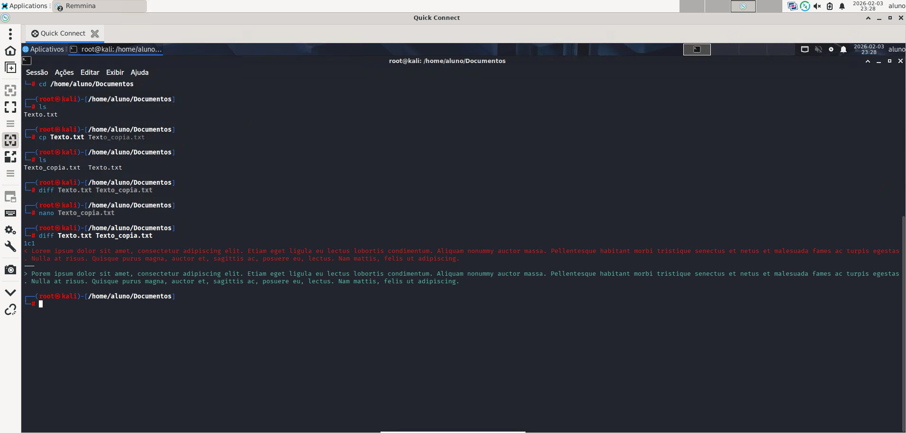
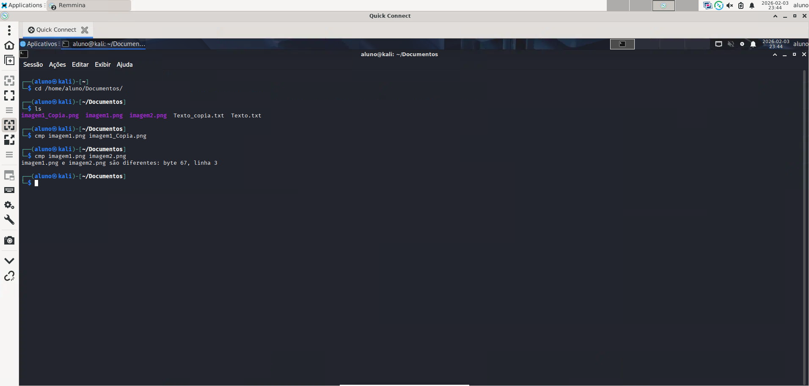
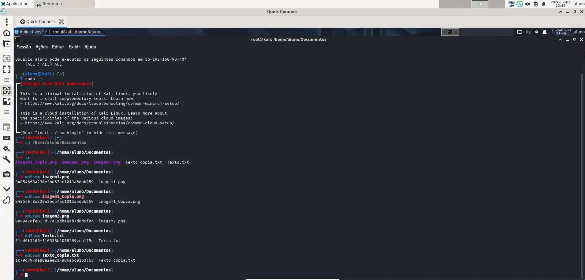
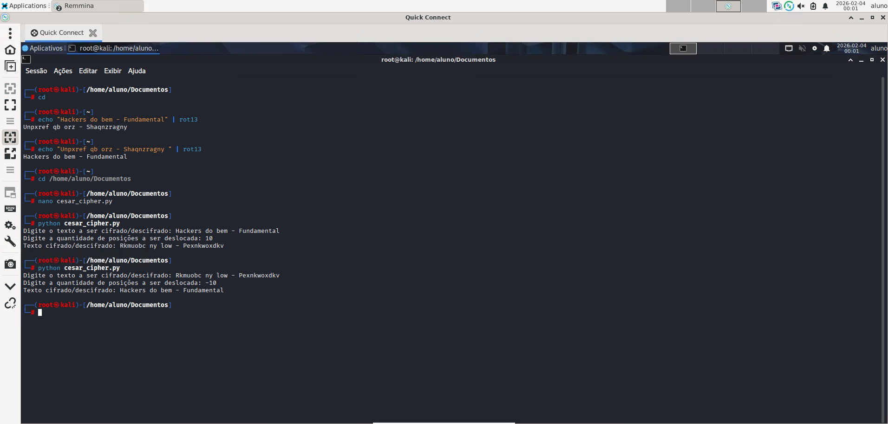
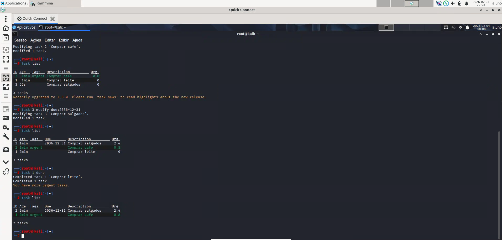

# 🛡️ Lab 01 — Fundamentos de Integridade, Hash e Criptografia no Kali Linux

## 📌 Descrição do Laboratório

Neste laboratório foram praticados conceitos fundamentais de Segurança da Informação utilizando o Kali Linux, com foco em:

- Verificação de integridade de arquivos de texto e binários  
- Detecção de alterações utilizando comandos nativos do Linux  
- Uso de funções hash para validação de arquivos  
- Aplicação de criptografia básica (ROT13 e Cifra de César)  
- Automação simples em Python  
- Organização e controle de tarefas via linha de comando  

Esses conceitos são amplamente utilizados em atividades de **Blue Team, Forense Digital e Monitoramento de Sistemas**.

---

## 🛠️ Ferramentas e Tecnologias Utilizadas

- Kali Linux  
- `diff`  
- `cmp`  
- `md5sum`  
- Python 3  
- `rot13`  
- `nano`  
- Taskwarrior  

---

## 📂 Estrutura do Repositório

```text
lab01-fundamentos-ciberseguranca/
│
├── README.md
└── cifra_cesar
    ├── cesar_cipher.py
└── screenshots/
    ├── atividade1_diff.png
    ├── atividade2_cmp.png
    ├── atividade3_md5.png
    ├── atividade4_cifra.png
    └── atividade5_taskwarrior.png
```

--- 

## 🧪 Atividades Realizadas
### 🔍 Atividade 1 — Comparação de Integridade de Arquivos de Texto

Foi criado um arquivo de texto e uma cópia, onde posteriormente uma modificação foi aplicada.
Utilizou-se o comando:
```bash
diff Texto.txt Texto_copia.txt
```
📷 Evidência: 

---  

### 🖼️ Atividade 2 — Comparação de Arquivos Binários (Imagens)

Foram comparadas imagens idênticas e uma imagem alterada utilizando:
```bash
cmp Imagem1.png Imagem2.png
```
📷 Evidência:

---  

### 🔐 Atividade 3 — Verificação de Integridade com Hash MD5

Geração de hashes para validação dos arquivos:
```bash
md5sum Imagem1.png Imagem1_copia.png Imagem2.png Texto.txt Texto_copia.txt
```
📷 Evidência:

---   

### 🔒 Atividade 4 — Criptografia ROT13 e Cifra de César em Python

ROT13 via terminal:
```bash
echo "Hackers do bem - Fundamental" | rot13
```
Script Python para Cifra de César:
```bash
python3 cesar_cipher.py
```
📷 Evidência: 

---    

### 📋 Atividade 5 — Gerenciamento de Tarefas com Taskwarrior

Criação, priorização e conclusão de tarefas: 
```bash
task add Comprar leite
task 2 modify +urgent
task 1 done
```

📷 Evidência:

---    

### 🎯 Principais Aprendizados

- Detecção de alterações em arquivos no Linux
- Validação de integridade com hash
- Fundamentos de criptografia
- Automação básica em Python
- Uso produtivo do terminal em ambientes de segurança

---    
