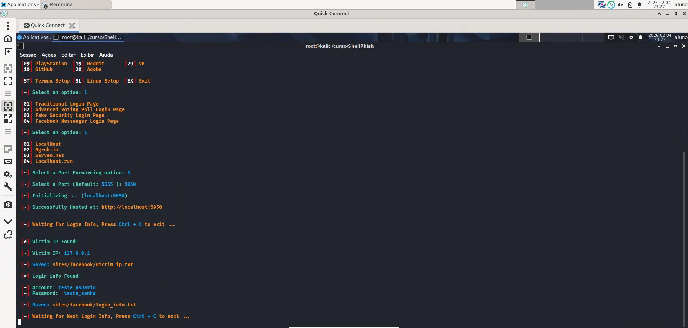
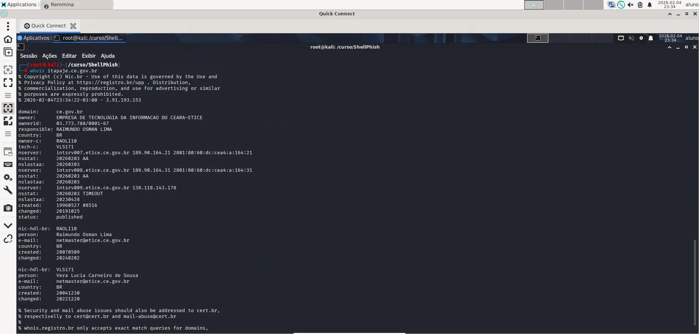
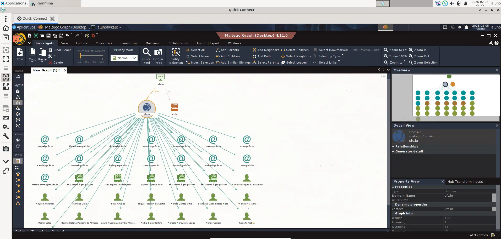
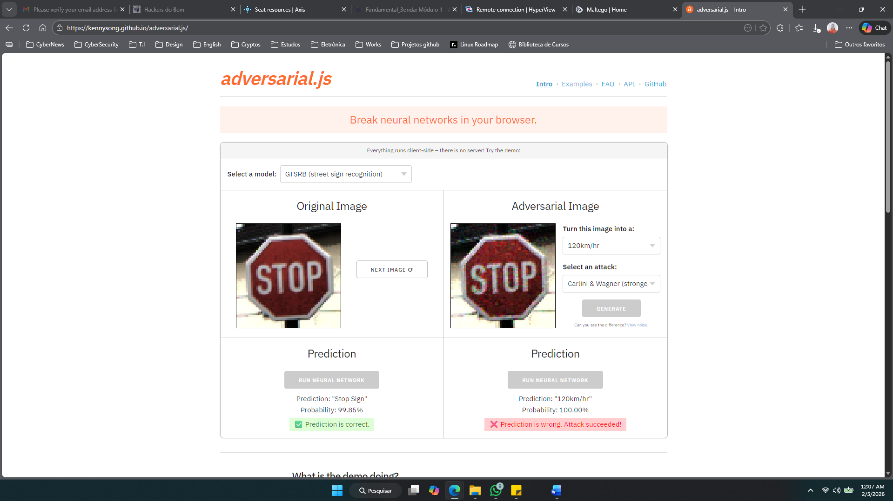

# 🛡️ Lab 02 — OSINT, Phishing e Introdução à Threat Intelligence

## 📌 Descrição do Laboratório

Neste laboratório foram explorados conceitos de reconhecimento de informações públicas (OSINT), engenharia social por meio de simulação de phishing e análise inicial de inteligência de ameaças, utilizando ferramentas amplamente aplicadas em investigações de segurança da informação.

As atividades tiveram como foco compreender como atacantes coletam dados e como essas técnicas podem ser utilizadas defensivamente para prevenção, monitoramento e resposta a incidentes em ambientes corporativos.

---

## 🛠️ Ferramentas e Tecnologias Utilizadas

- Kali Linux  
- ShellPhish (simulação de phishing educacional)  
- WHOIS  
- Maltego Community Edition  
- Navegador Web  
- Conceitos básicos de Adversarial Machine Learning  

---

## 📂 Estrutura do Repositório

```text
lab02-osint-phishing-threat-intel/
│
├── README.md
└── screenshots/
    ├── atividade1_6_phishing.png
    ├── atividade1_7_whois.png
    ├── atividade1_8_maltego_hub.png
    ├── atividade1_9_maltego_osint.png
    └── atividade1_10_adversarial_ml.png
```
---

## 🧪 Atividades Realizadas 
### 🎣 Atividade 1.6 — Simulação de Phishing Educacional
Foi realizada uma simulação controlada de phishing com o objetivo de compreender como páginas falsas são utilizadas para coleta de credenciais e como esse tipo de ataque pode ser identificado e prevenido em ambientes reais.

📷 Evidência:


--- 

### 🎣 Atividade 1.7 — Consulta de Informações Públicas com WHOIS
Utilizou-se a ferramenta WHOIS para coletar dados públicos de registros de domínio, analisando informações como:

- Provedor de registro
- Datas de criação e expiração
- Responsáveis técnicos

📷 Evidência:


---  

### 🧠 Atividade 1.8 — Exploração de Transforms no Maltego Hub

Foi explorado o Maltego Hub para compreender os diferentes transforms disponíveis, utilizados para correlação de dados públicos como domínios, IPs, e-mails e organizações.

📷 Evidência:


---   

###  🔍 Atividade 1.9 — Investigação OSINT com Maltego

Realizou-se uma análise prática no Maltego para mapear relações entre entidades, permitindo visualizar conexões entre domínios, infraestrutura e possíveis superfícies de ataque.

📷 Evidência:


---   

### 🤖 Atividade 1.10 — Introdução a Adversarial Machine Learning

Discussão e demonstração inicial sobre como sistemas de IA podem ser explorados ou manipulados por atacantes, ampliando o entendimento sobre novas superfícies de ameaça em ambientes modernos.

📷 Evidência:


---    

### 🎯 Principais Aprendizados

- Como técnicas de phishing são estruturadas e detectadas
- Coleta de informações públicas com WHOIS
- Uso de ferramentas OSINT profissionais como Maltego
- Correlação de dados para investigação de ameaças
- Noções iniciais de segurança em inteligência artificial

---   

###  📎 Contexto

Laboratório realizado no programa Hackers do Bem — Nível Fundamental, com foco em fundamentos práticos de cibersegurança, OSINT e compreensão de ameaças modernas.
