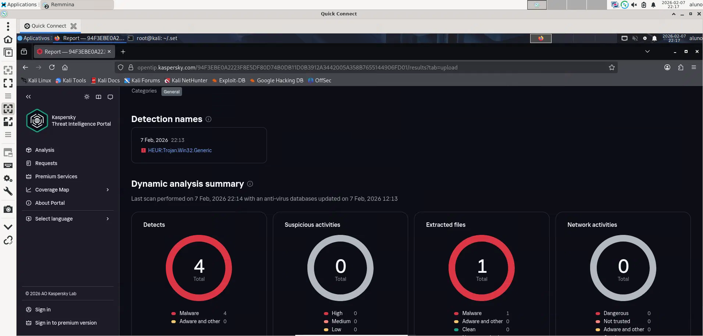
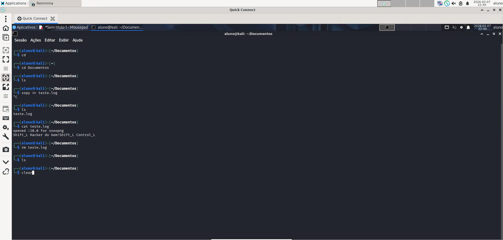
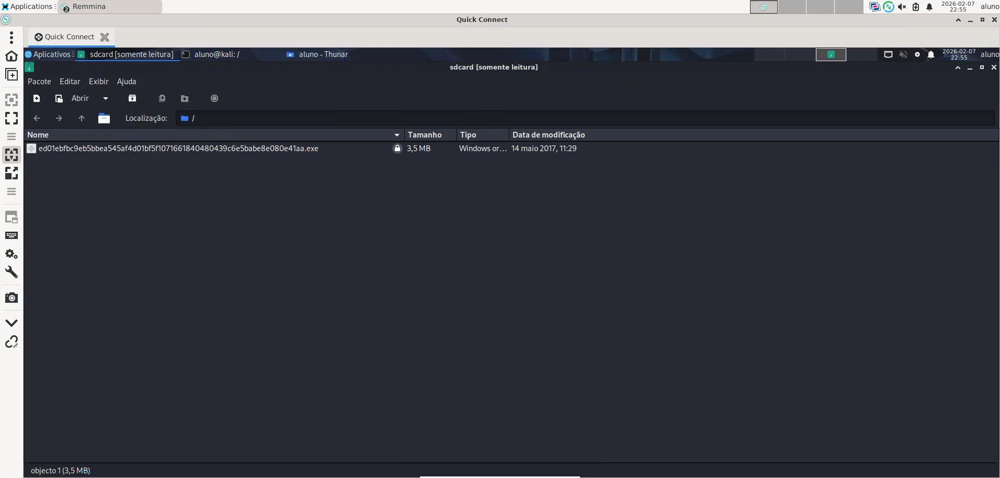
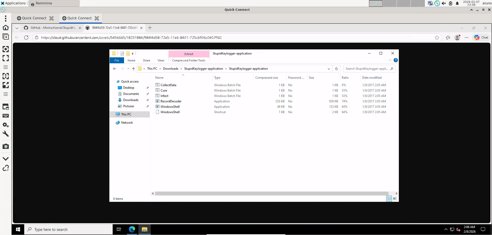

# 🛡️ Lab 03 — Análise de Malware, RATs, Ransomware e Mecanismos de Defesa

## 📌 Descrição do Laboratório

Neste laboratório foram explorados diferentes tipos de códigos maliciosos em um **ambiente controlado e exclusivamente acadêmico**, com o objetivo de compreender **como essas ameaças funcionam**, **como são detectadas** e **quais riscos representam** para sistemas corporativos.

As atividades proporcionaram uma visão prática sobre:
- Trojans de Acesso Remoto (RAT)
- Keyloggers
- Ransomwares
- Payloads maliciosos e hoax
- Mecanismos de detecção e bloqueio do Windows Defender

O foco do laboratório foi **educacional e defensivo**, alinhado à formação em **Blue Team e SOC**.

---

## 🛠️ Ferramentas e Tecnologias Utilizadas

- Kali Linux  
- Social-Engineer Toolkit (SET)  
- Metasploit Framework  
- XSPY Keylogger  
- Repositórios educacionais de malware  
- Windows Server 2022  
- Microsoft Defender SmartScreen  
- Kaspersky Threat Intelligence Portal  

---

## 📂 Estrutura do Repositório

```text
lab03-analise-malware/
│
├── README.md
└── screenshots/
    ├── atividade2_1_rat_detection.png
    ├── atividade2_2_keylogger_log.png
    ├── atividade2_3_ransomware_file.png
    ├── atividade2_4_payload_prank.png
    └── atividade2_5_defender_block.png
``` 

--- 

## 🧪 Atividades Realizadas
### 🧬 Atividade 2.1 — Análise de Trojan de Acesso Remoto (RAT)

Nesta atividade foi demonstrado, em ambiente controlado, como um Trojan de Acesso Remoto pode ser gerado para fins de estudo, bem como sua detecção por plataformas de inteligência de ameaças.

📷 Print da atividade 2.1: Evidência da análise do arquivo malicioso em serviço de Threat Intelligence, demonstrando sua identificação como malware. 

---

### ⌨️ Atividade 2.2 — Funcionamento de um Keylogger no Linux

Foi analisado o funcionamento de um keylogger, observando como entradas de teclado podem ser capturadas e armazenadas, reforçando a importância de controles de segurança e monitoramento de processos.

📷 Print da atividade 2.2: Evidência do arquivo de log gerado contendo as entradas capturadas.

--- 

### 🔐 Atividade 2.3 — Estudo de Ransomware (WannaCry)

Nesta atividade foi explorado um repositório educacional de ransomwares, com foco na análise do WannaCry, compreendendo como esse tipo de ameaça é estruturado e distribuído, sem execução em sistemas reais.

📷 Print da atividade 2.3: Evidência do arquivo executável gerado para fins de estudo. 

---  

### 🎭 Atividade 2.4 — Análise de Payloads e Hoax

Foi analisado um conjunto de payloads do tipo hoax, demonstrando como ações aparentemente simples podem ser utilizadas de forma maliciosa para enganar usuários ou causar impactos operacionais.

📷 Print da atividade 2.4: Evidência do payload de prank gerado para análise. 

---   

### 🛑 Atividade 2.5 — Detecção de Keylogger pelo Windows Defender

Nesta atividade foi analisado como o Microsoft Defender SmartScreen atua na proteção do sistema, bloqueando automaticamente o download de arquivos identificados como maliciosos.

📷 Print da atividade 2.5: Evidência do bloqueio do arquivo pelo Windows Defender. 

---  

### 🎯 Principais Aprendizados

- Compreensão prática do funcionamento de RATs, keyloggers e ransomwares
- Importância da análise de malware em ambientes isolados
- Papel da Threat Intelligence na identificação de arquivos maliciosos
- Como soluções de segurança do Windows atuam preventivamente
- Visão defensiva sobre técnicas utilizadas por atacantes 

---   

### 🚀 Próximos Passos

- Aprofundar estudos em análise estática e dinâmica de malware
- Relacionar esses ataques com eventos de SIEM
- Estudar resposta a incidentes envolvendo malware
- Evoluir o entendimento em Threat Intelligence e Blue Team

---    

### 📎 Contexto Acadêmico

Laboratório realizado no Programa Hackers do Bem — Nível Fundamental, com foco em análise de malware, compreensão de ameaças e mecanismos de defesa, sempre em ambiente controlado e com finalidade educacional.
