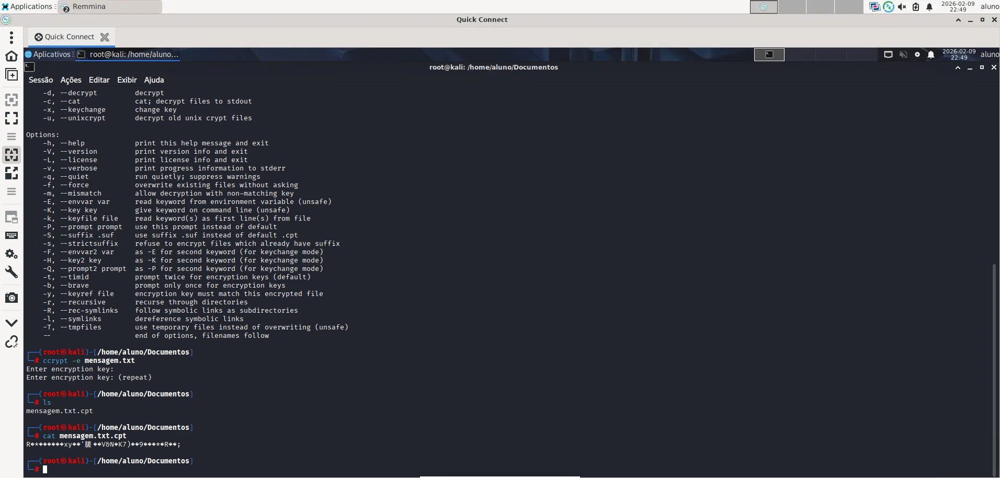

# 🛡️ Lab 04 — Controles Técnicos, Eventos de Sistema e Navegação Anônima

## 📌 Descrição do Laboratório

Este laboratório teve como objetivo explorar diferentes **controles técnicos e ferramentas de análise e detecção em ambientes de segurança**, com foco defensivo e acadêmico. As atividades envolveram:

- Criptografia de arquivos para proteção de dados
- Análise de logs para identificação de eventos de sistema
- Exploração segura de navegação anônima com Tor
- Entendimento de políticas de segurança do Windows Server 2022

O foco foi compreender como essas técnicas e ferramentas podem apoiar equipes de **SOC, Blue Team e resposta a incidentes** na proteção de sistemas reais.

---

## 🛠️ Ferramentas e Tecnologias Utilizadas

- Kali Linux  
- CCrypt (criptografia de arquivos)  
- Logcheck (análise de eventos de sistema)  
- Navegador Tor (privacidade e navegação anônima)  
- Windows Server 2022 (políticas de segurança locais)  

---

## 📂 Estrutura do Repositório

```text
lab04-controles-tecnicos-eventos-sistema/
│
├── README.md
└── screenshots/
    ├── atividade2_6_ccrypt.png
    ├── atividade2_7_logcheck.png
    ├── atividade2_8_tor_connect.png
    ├── atividade2_9_tor_navigation.png
    └── atividade2_10_windows_policies.png
```

---

## 🧪 Atividades Realizadas
### 🔐 Atividade 2.6 — Controle Técnico de Criptografia com CCrypt

Nesta atividade explorou-se a ferramenta CCrypt, utilizada para criptografar e descriptografar arquivos de forma segura. A criptografia de dados é um controle técnico essencial para proteger informações sensíveis contra acesso não autorizado, e esta atividade demonstrou como aplicar esse mecanismo no Kali Linux.

📷 Print da atividade 2.6: Evidência do arquivo criptografado e descriptografado com sucesso.


--- 

### 📊 Atividade 2.7 — Análise de Eventos de Sistema com Logcheck

Foi utilizada a ferramenta Logcheck para analisar os eventos de sistema no Kali Linux, identificando e classificando mensagens de log relevantes. A capacidade de análise de logs é fundamental em ambientes de detecção e resposta a incidentes.

📷 Print da atividade 2.7: Evidência da saída de eventos relevantes do sistema após análise com Logcheck.

--- 

### 🧪 Atividade 2.8 — Exploração do Navegador Tor

Esta atividade explorou o uso do navegador Tor para estabelecer conexão com a rede Tor, permitindo navegação anônima e reforçando conceitos de privacidade e anonimato na web.

📷 Print da atividade 2.8: Evidência da conexão estabelecida com a rede Tor.

--- 

### 🌐 Atividade 2.9 — Navegação na Deep Web com Tor

Com o Tor configurado, realizou-se navegação em sites da Deep Web (extensão .onion), reforçando noções de anonimato, segurança e cuidados a serem tomados ao explorar redes que não são indexadas pelo tráfego comum da internet.

📷 Print da atividade 2.9: Evidência de acesso a um site .onion via Tor.

---  

### 🔒 Atividade 2.10 — Políticas de Segurança no Windows Server 2022

Nesta atividade foi explorado o painel de Políticas Locais e de Conta no Windows Server 2022, incluindo o entendimento de:

- Políticas de senha
- Bloqueio de contas
- Auditoria e eventos de segurança

Essas políticas são controles gerenciais importantes para fortalecer a postura de segurança em sistemas corporativos.

📷 Print da atividade 2.10: Evidência das configurações de políticas locais no Windows Server.

---  

### 🎯 Principais Aprendizados

- Aplicação de criptografia em dados sensíveis
- Análise e interpretação de logs de sistema
- Navegação anônima segura com Tor
- Navegação na Deep Web com cuidado e contexto defensivo
- Configuração de políticas de segurança em ambiente Windows

---

### 🚀 Próximos Passos

- Integrar a análise de logs com ferramentas SIEM reais
- Aprofundar o uso de criptografia na proteção de dados em trânsito e repouso
- Explorar inteligência de rede com ferramentas OSINT adicionais
- Entender resposta a incidentes em ambientes heterogêneos

--- 

📎 Contexto Acadêmico

Laboratório realizado no Programa Hackers do Bem — Nível Fundamental, com foco em controles técnicos, análise de eventos e navegação anônima, sempre com objetivo de reforçar boas práticas de segurança ofensiva e defensiva.
