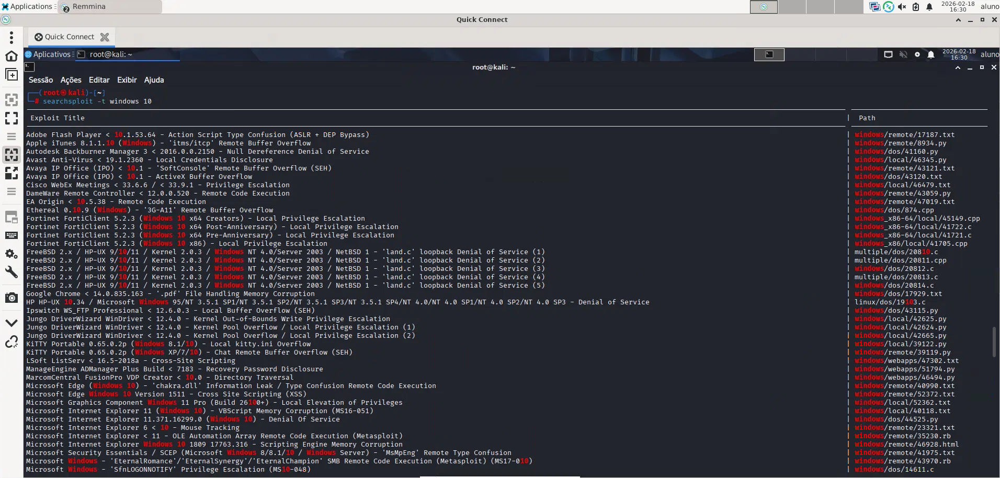

# 🛡️ Lab 05 — Módulo 3: Ferramentas de Segurança Ofensiva no Kali Linux

> **Curso:** Fundamentos de Segurança da Informação — RNP/ESR  
> **Módulo:** 3 — Aulas 1 e 2

---

## 📁 Estrutura do Repositório

```
lab05-ferramentas-seguranca-ofensiva/
│
├── README.md
└── screenshots/
    ├── atividade3_1_searchsploit_windows10.png
    ├── atividade3_2_nmap_open_ports.png
    ├── atividade3_3_burpsuite_http_history.png
    ├── atividade3_4_netcat_request.png
    └── atividade3_5_ncat_redirect.png
```

---

## 📋 Sobre este laboratório

Neste laboratório são exploradas cinco ferramentas fundamentais para testes de segurança (pentest) em ambientes controlados. O objetivo é aprender a identificar vulnerabilidades conhecidas, realizar varreduras de rede, interceptar tráfego HTTP/HTTPS, escutar conexões em portas específicas e redirecionar tráfego entre portas — tudo com fins estritamente acadêmicos.

---

## 📑 Índice

- [Atividade 3.1 — Exploit Database (searchsploit)](#-atividade-31--exploit-database-searchsploit)
- [Atividade 3.2 — Varreduras com Nmap](#-atividade-32--varreduras-com-nmap)
- [Atividade 3.3 — Interceptação com Burp Suite](#-atividade-33--interceptação-com-burp-suite)
- [Atividade 3.4 — Escuta de requisições com Netcat](#-atividade-34--escuta-de-requisições-com-netcat)
- [Atividade 3.5 — Redirecionamento de tráfego com Ncat](#-atividade-35--redirecionamento-de-tráfego-com-ncat)
- [Ferramentas utilizadas](#-ferramentas-utilizadas)
- [Aprendizados](#-aprendizados)

---

## 🔍 Atividade 3.1 — Exploit Database (searchsploit)

### O que é?
O **Exploit Database** é um repositório público de exploits e vulnerabilidades. A ferramenta `searchsploit` permite pesquisar localmente nessa base de dados diretamente pelo terminal do Kali Linux, sem depender de conexão com a internet.

### O que foi feito?
- Verificação dos arquivos locais do ExploitDB em `/usr/share/exploitdb`
- Exploração dos parâmetros disponíveis do `searchsploit`
- Atualização da base de dados com `searchsploit -u`
- Busca de exploits relacionados ao **OpenSSL** — retornou exploits, shellcodes e papers documentando vulnerabilidades históricas
- Busca de exploits relacionados ao **OpenSSH** — listou ataques de enumeração de usuários, buffer overflows e escalação de privilégios
- Busca filtrada por título (`-t`) para exploits do **Windows 10**
- Acesso ao site oficial https://www.exploit-db.com/ para exploração via navegador

### Comandos principais
```bash
ls -al /usr/share/exploitdb          # Localiza os arquivos da base
searchsploit                         # Exibe ajuda e parâmetros
searchsploit -u                      # Atualiza a base de dados
searchsploit openssl                 # Busca exploits do OpenSSL
searchsploit openssh                 # Busca exploits do OpenSSH
searchsploit -t windows 10           # Busca por título: Windows 10
```

> 📸 Terminal exibindo os resultados da busca `searchsploit -t windows 10`


---

## 🌐 Atividade 3.2 — Varreduras com Nmap

### O que é?
O **Nmap** (Network Mapper) é uma das ferramentas de código aberto mais usadas em segurança ofensiva e defensiva. Ele permite descobrir hosts ativos, portas abertas, serviços em execução e características do sistema operacional em uma rede.

### O que foi feito?
- Verificação das interfaces de rede com `ifconfig`
- Varredura de hosts ativos na rede `192.168.98.0/24` com **ping scan** (`-sn`)
- Exportação dos IPs encontrados para um arquivo `ips.txt` combinando `nmap`, `grep` e `cut`
- Varredura ACK (`-sA`) para detectar hosts protegidos por firewall
- Varredura completa com `--open` para identificar portas abertas em toda a rede
- Uso do `--packet-trace` para visualizar os pacotes enviados e recebidos em tempo real

### Comandos principais
```bash
ifconfig                                            # Visualiza interfaces de rede
nmap -sn "ip-da-interface"                          # Ping scan (hosts ativos)
nmap -sn 192.168.0.1/24 | grep 192 | cut -d ' ' -f 5 > ips.txt  # Exporta IPs
nmap -sA 192.168.0.1/24                           # Detecta firewalls (ACK scan)
nmap --open 192.168.0.1/24                        # Lista portas abertas
nmap --packet-trace 192.168.0.1/24                # Exibe pacotes enviados/recebidos
rm ips.txt                                          # Remove arquivo temporário
```

> 📸 Terminal exibindo resultado do `nmap --open 192.168.0.1/24` com o estado de cada host e suas portas

---

## 🔐 Atividade 3.3 — Interceptação com Burp Suite

### O que é?
O **Burp Suite** é uma plataforma completa de testes de segurança em aplicações web, desenvolvida pela PortSwigger. Seu recurso mais conhecido é o **proxy interceptador**, que permite capturar, visualizar e modificar o tráfego entre o navegador e o servidor antes que ele seja enviado.

### O que foi feito?
- Inicialização do Burp Suite no modo "Temporary Project" com configurações padrão
- Verificação do proxy listener ativo na interface `127.0.0.1:8080`
- Configuração do **Mozilla Firefox** para usar o Burp como proxy HTTP/HTTPS na porta 8080
- Acesso ao painel do Burp via `http://burp` no navegador
- Download e instalação do **certificado CA** do Burp Suite no Firefox (para interceptação HTTPS)
- Ativação do modo **"Intercept is on"**
- Tentativa de acesso ao site `https://casasbahia.com.br/` — tráfego interceptado com sucesso
- Visualização dos headers HTTP capturados: Host, Cookie, User-Agent, etc.
- Análise do **HTTP history** com o histórico completo de requisições interceptadas
- Liberação do tráfego com o botão **Forward**

### Fluxo da interceptação
```
Firefox → [Proxy 127.0.0.1:8080] → Burp Suite → Servidor web
                                         ↓
                              Você analisa/modifica aqui
```

> 📸 Tela do Burp Suite na aba "HTTP history" exibindo as requisições interceptadas do Firefox

---

## 🎧 Atividade 3.4 — Escuta de requisições com Netcat

### O que é?
O **Netcat** (`nc`) é conhecido como o "canivete suíço das redes". Ele permite criar conexões TCP/UDP, transferir dados, fazer port scanning básico e criar servidores de escuta simples — tudo pela linha de comando.

### O que foi feito?
- Exploração dos modos de operação do Netcat com `nc -help`
- Verificação do IP da máquina com `ifconfig`
- Configuração do Netcat para escutar na porta **5555** em modo verbose
- Acesso via Firefox ao endereço `http://192.168.98.40:5555`
- Captura completa da requisição HTTP no terminal, incluindo:
  - Método GET e versão HTTP
  - Header `Host`
  - Header `User-Agent` (identificação do Firefox)
  - Headers `Accept`, `Accept-Language`, `Accept-Encoding`, etc.

### Comandos principais
```bash
nc -help                  # Exibe modos de operação
ifconfig                  # Descobre o IP da máquina
nc -l -p 5555 -v          # Escuta na porta 5555 com verbose
```

> 📸 Terminal mostrando o Netcat capturando a requisição HTTP do Firefox com todos os headers

---

## 🔄 Atividade 3.5 — Redirecionamento de tráfego com Ncat

### O que é?
O **Ncat** é uma versão moderna e aprimorada do Netcat, distribuída junto com o Nmap. Ele permite, entre outras coisas, criar **tunelamento** entre portas — ou seja, redirecionar conexões recebidas em uma porta para outra porta diferente.

### O que foi feito?
- Uso do **Ncat** para redirecionar tráfego da porta **80** para a porta **443**
- Abertura de um segundo terminal conectando-se ao **localhost na porta 80**
- Abertura de um terceiro terminal conectando-se ao **localhost na porta 443**
- Envio de mensagem "**Teste A**" do Terminal 3 (porta 443) → recebida no Terminal 2 (porta 80)
- Envio de mensagem "**Teste B**" do Terminal 2 (porta 80) → recebida no Terminal 3 (porta 443)
- Demonstração de um **chat bidirecional** entre as duas portas via redirecionamento

### Comandos principais
```bash
# Terminal 1 — redirecionamento
ncat -vl 80 -c 'ncat -l 443'

# Terminal 2 — conecta na porta 80
ncat -nv 127.0.0.1 80

# Terminal 3 — conecta na porta 443
ncat -v 127.0.0.1 443
```

### Fluxo do redirecionamento
```
Terminal 2 (porta 80) ←→ [Ncat bridge] ←→ Terminal 3 (porta 443)
```

> 📸 Terminal 3 exibindo a mensagem "Teste B" recebida do Terminal 2, confirmando o redirecionamento bidirecional entre as portas

---

## 🛠️ Ferramentas utilizadas

| Ferramenta | Função |
|---|---|
| `searchsploit` / ExploitDB | Pesquisa de exploits e vulnerabilidades conhecidas |
| `nmap` | Varredura de redes, hosts e portas |
| Burp Suite | Interceptação e análise de tráfego web |
| `netcat` (nc) | Escuta e comunicação via portas TCP/UDP |
| `ncat` | Redirecionamento e tunelamento de tráfego entre portas |

---

## 📚 Aprendizados

- Como pesquisar exploits por produto/versão usando o ExploitDB localmente
- Como mapear uma rede e identificar hosts ativos, portas abertas e possíveis firewalls com Nmap
- Como configurar um proxy de interceptação para analisar o tráfego HTTPS de um navegador com Burp Suite
- Como capturar e inspecionar requisições HTTP em tempo real usando Netcat
- Como criar redirecionamentos de tráfego entre portas com Ncat, simulando técnicas de pivoting e port forwarding

---

> ⚠️ **Aviso:** Todo o conteúdo deste repositório foi desenvolvido exclusivamente para fins acadêmicos em ambientes controlados. O uso dessas técnicas em sistemas sem autorização expressa é ilegal.
